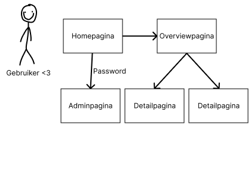

# Fase 3: Ideate (Oplossingen bedenken)

  

## 1. Concepten

* **How-Might-We vraag:** Hoe kunnen wij de ontkoking van onze generatie oplossen?

* **Concept 1:** Op de overview page gaan wij gebruik maken van filters zoals, vegatarisch, veganistisch, kort tijdsduur, enz. met daarbij een integer inpunt waar jij de prijsmarge van de maaltijden kan beslissen die voor jouw worden gepresenteerd
op de website. Nieuwe recepten kunnen gemailed worden naar onze e-mail en zullen wij dat via onze encrypte admin page wij recepten toevoegen, bewerken en desnoods verwijderen.

* **Concept 2:** Op onze website gaan wij gebruik maken van een accountsysteem dat jou bemachtigt tot het toevoegen,
bewerken en verwijderen van jouw recepten. Het accountsysteem zorgt ervoor dat niemand anders jouw recepten kunt
aantasten met onvriendelijke intenties. Hiervoor vragen wij dat de site zwaar modereren om shitposting tegen te gaan.
Voor de zekerheid is er dan een admin page die nog alles van iedereen kan bewerken en verwijderen als de situatie er
om vraagt.

  

## 2. Conceptkeuze & Onderbouwing

Beide concepten maken gebruik van PHP en een database om te functioneren. Een van de twee concepten maakt gebruik van een searchbar en een accountsysteem. Beide concepten maken gebruik van een CRUD-systeem in de site en een overviewpagina met daarbij een detailpagina die verandert met elk ID dat jij klikt op de overviewpagina.

  

## 3. User Flow (Visueel)

  

### **04-prototype.md**

  

