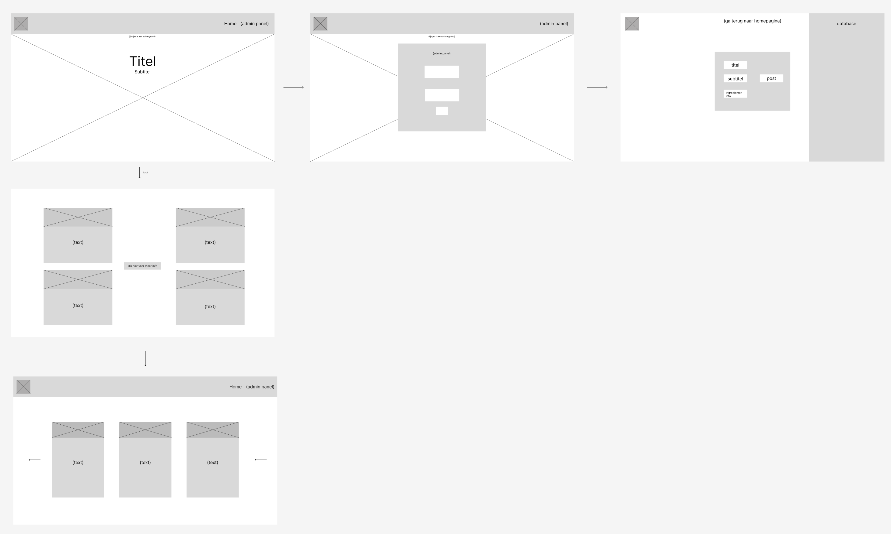
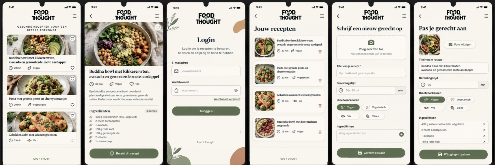
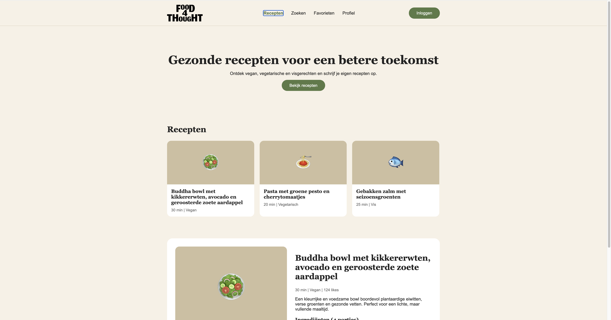
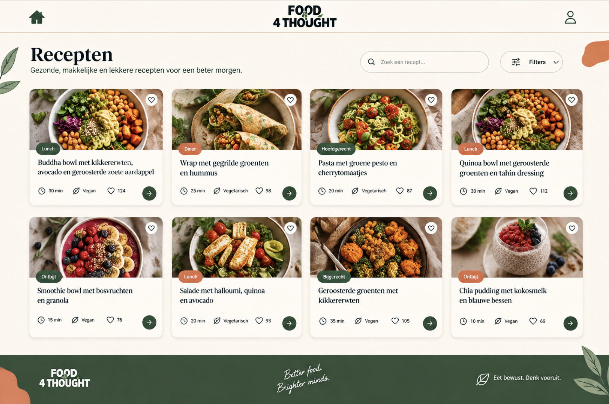

### **04-prototype.md**

# Fase 4: Prototype (Ontwerp & Techniek)

  

## 1. Wireframes (Lo-Fi)
## Mobile First wireframes
*Op volgorde zie je hoe je door de schermen heen gaat. Als je je recepten wil bekijken kan dat door erop te drukken ook hebben we een adminpaneel om meer te kunnen doen zoals je recepten verwijderen en bewerken of een nieuwe maken en daar begint het mee zodat je een logboek hebt aan recepten.*

## Laptop wireframe

## 2. Visual Design (Hi-Fi)

## Mobile prototype
*Hier volg je elke pagina op volgorde als een dia slide hoe hij er uit moet komen te zien*

## Desktop prototype

*Hierbij de main pagina voor de  desktop versie dat gelijk loopt met de mobiele versie.*

## 3. Technische Architectuur

* **Frontend:** [CSS, JS, Tailwindcss]

* **Backend/Data:** [MySQL, JS,PHP]
* **Versie beheer:** [Github REPO]