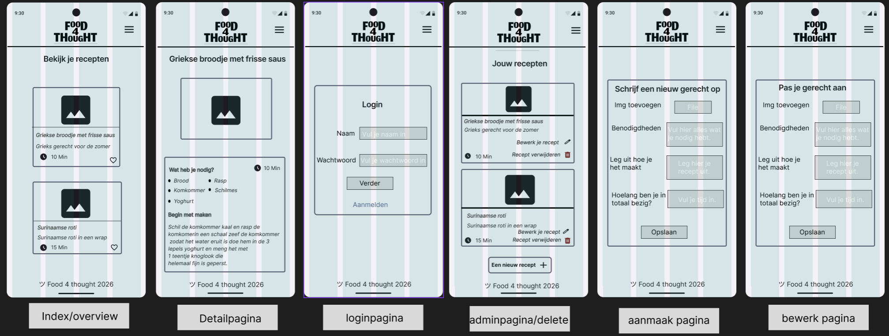

### **04-prototype.md**

# Fase 4: Prototype (Ontwerp & Techniek)

  

## 1. Wireframes (Lo-Fi)
## Mobile First wireframes
*Op volgorde zie je hoe je door de schermen heen gaat. Als je je recepten wil bekijken kan dat door erop te drukken ook hebben we een adminpaneel om meer te kunnen doen zoals je recepten verwijderen en bewerken of een nieuwe maken en daar begint het mee zodat je een logboek hebt aan recepten.*

  

## 2. Visual Design (Hi-Fi)

  

## 3. Technische Architectuur

* **Frontend:** [Bijv. HTML, CSS, Vanilla JS]

* **Backend/Data:** [Bijv. Lokale JSON of Externe API]